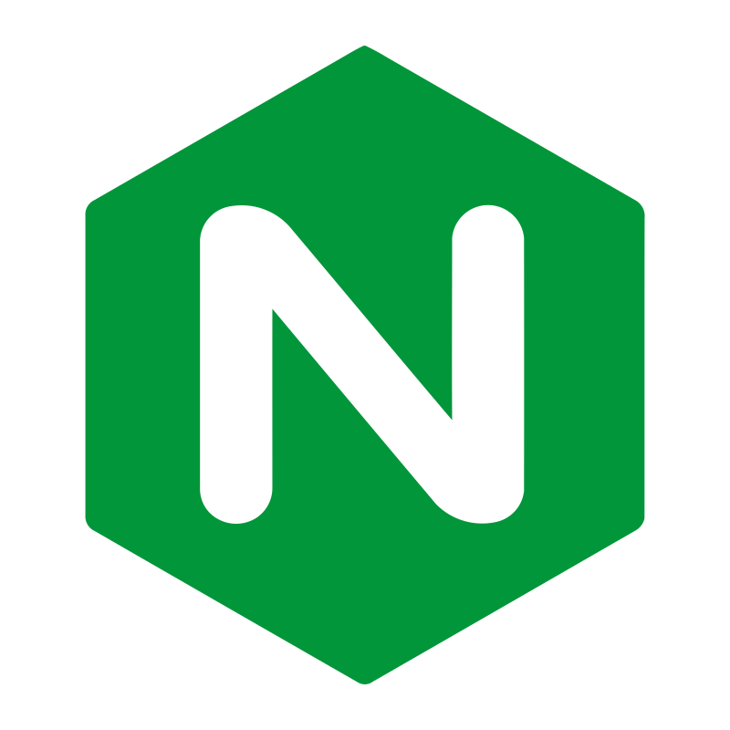

Hi My name is Maxim
=============================================================================================================================

Developer and DevOps engineer
-----------------------------
* 🌍  I'm based in Kemerovo
* 🖥️  See my portfolio at [site](http://vmlose.com)
* ✉️  You can contact me at [maximm.14@yandex.ru](mailto:maximm.14@yandex.ru)
* 🚀  I'm currently working on [bypass](http://github.com/Losenmann/Bypass)
* 🧠  I'm learning golang, python, groovy
* 🤝  I'm open to collaborating on kubernetes

### Skills

### Socials

  <a href="https://www.github.com/Losenmann" target="_blank" rel="noreferrer">
    <picture>
      <source media="(prefers-color-scheme: dark)" srcset="https://raw.githubusercontent.com/danielcranney/readme-generator/main/public/icons/socials/github.svg" />
      <source media="(prefers-color-scheme: light)" srcset="https://raw.githubusercontent.com/danielcranney/readme-generator/main/public/icons/socials/github.svg" />
      
    </picture>
  </a>
  <a href="https://hub.docker.com/u/losenmann" target="_blank" rel="noreferrer">
    <picture>
      <source media="(prefers-color-scheme: dark)" srcset="pages/src/image/docker-colored.svg" />
      <source media="(prefers-color-scheme: light)" srcset="pages/src/image/docker-colored.svg" />
      
    </picture>
  </a>
  <a href="http://www.instagram.com/losenmann" target="_blank" rel="noreferrer">
    <picture>
      <source media="(prefers-color-scheme: dark)" srcset="https://raw.githubusercontent.com/danielcranney/readme-generator/main/public/icons/socials/instagram.svg" />
      <source media="(prefers-color-scheme: light)" srcset="https://raw.githubusercontent.com/danielcranney/readme-generator/main/public/icons/socials/instagram.svg" />
      
    </picture>
  </a>

### Badges
<b>My GitHub Stats</b>

<b>Top Repositories</b>

       

### Support Me
<iframe src="https://yoomoney.ru/quickpay/fundraise/button?billNumber=1721SLED0IP.241210&" width="330" height="50" frameborder="0" allowtransparency="true" scrolling="no"></iframe>

​
